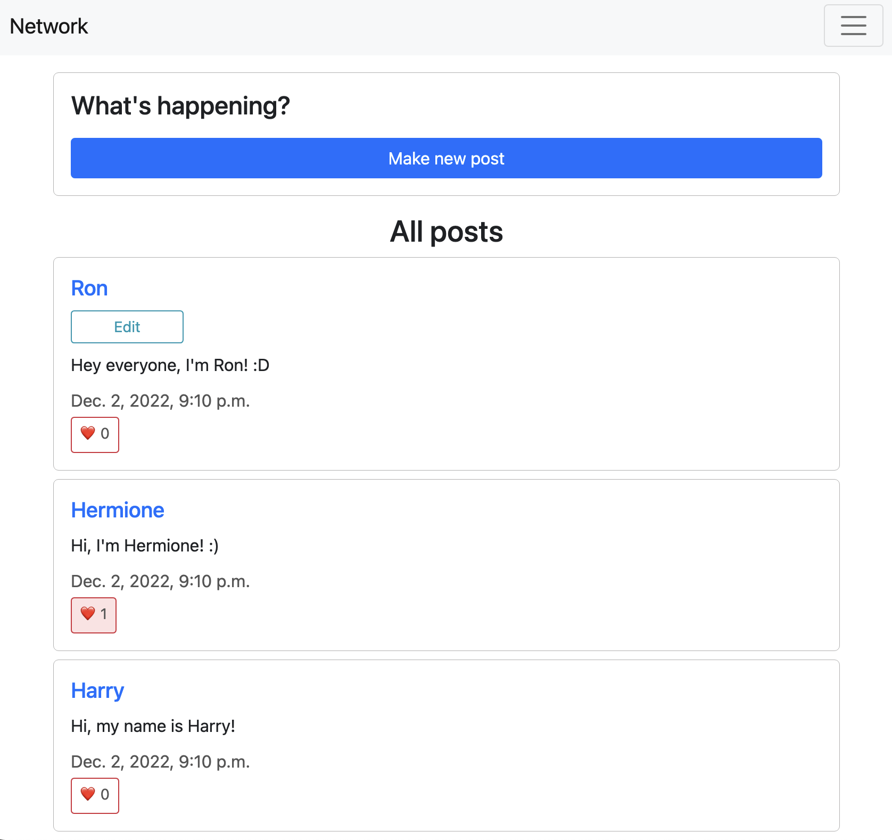

# CS50's Web Programming - Network Assignment

This is a twitter-like network webpage created as part of The CS50's Web Programming with Python and JavaScript course.  

[📹 Youtube demo](https://youtu.be/0Db02DjC_XM)

## Outcomes
- Design a networking page that uses Python, JavaScript, HTML, and CSS
- Implemented API calls using fetch to asynchronously update values
- Selected HTML elements using JavaScript for an interactive webpage
- Added pagination to display posts
- Used JavaScript to update likes and follows with API calls
- Applied CSS styling to better user experience
- Used Git and GitHub for overall project management

### Technologies & Resources Used
-  &emsp;  &emsp;  &emsp;  &emsp;  &emsp;  

## Specifications 
- [x] Users who are signed in should be able to write a new text-based post by filling in text into a text area and then clicking a button to submit the post.
- [x] The “All Posts” link in the navigation bar should take the user to a page where they can see all posts from all users, with the most recent posts first.
    - [x] Each post should include the username of the poster, the post content itself, the date and time at which the post was made, and the number of “likes” the post has (this will be 0 for all posts until you implement the ability to “like” a post later).
- [x] Clicking on a username should load that user’s profile page. This page should display the number of followers the user has, as well as the number of people that the user follows.
    - [x] Page should also display all of the posts for that user, in reverse chronological order.For any other user who is signed in, this page should also display a “Follow” or “Unfollow” button that will let the current user toggle whether or not they are following this user’s posts. 
- [x] On any page that displays posts, posts should only be displayed 10 on a page. If there are more than ten posts, a “Next” button should appear to take the user to the next page of posts (which should be older than the current page of posts). If not on the first page, a “Previous” button should appear to take the user to the previous page of posts as well.
- [x] Users should be able to click an “Edit” button or link on any of their own posts to edit that post.When a user clicks “Edit” for one of their own posts, the content of their post should be replaced with a textarea where the user can edit the content of their post.
    - [x] The user should then be able to “Save” the edited post. Using JavaScript, you should be able to achieve this without requiring a reload of the entire page.
    - [x] For security, ensure that your application is designed such that it is not possible for a user, via any route, to edit another user’s posts.
- [x] Users should be able to click a button or link on any post to toggle whether or not they “like” that post.
    - [x] Using JavaScript, you should asynchronously let the server know to update the like count (as via a call to fetch) and then update the post’s like count displayed on the page, without requiring a reload of the entire page.